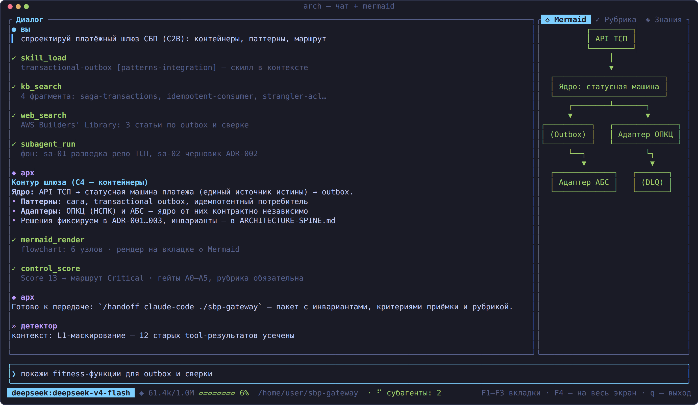
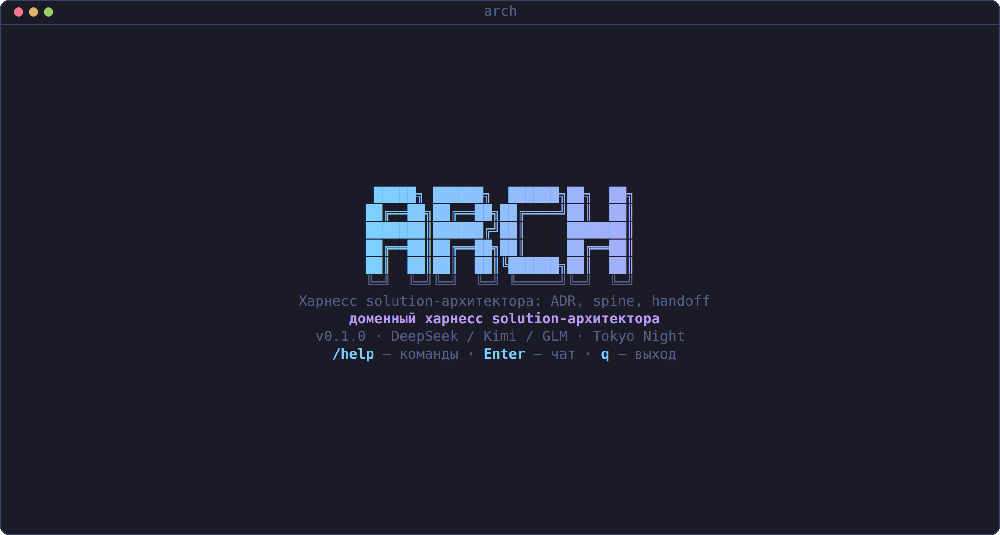
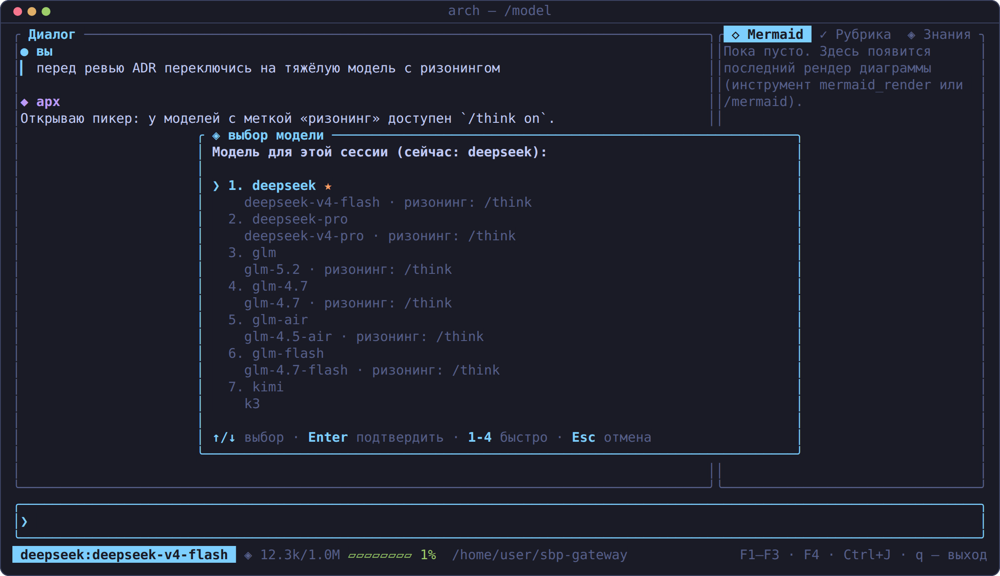
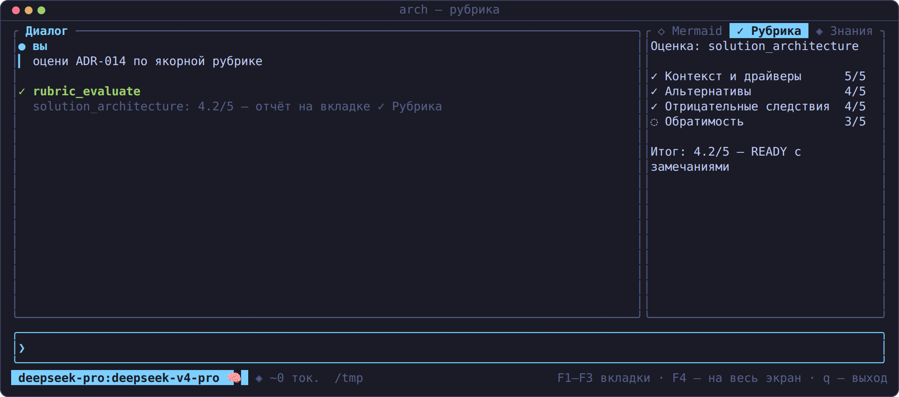
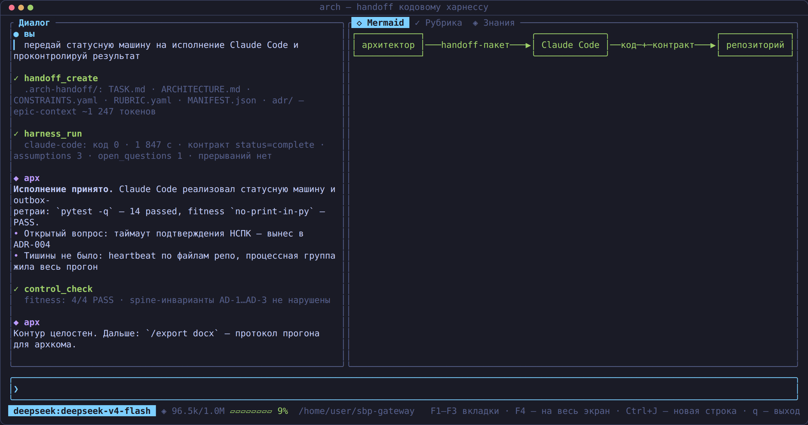

# Spine

<p align="center">
  <b>🇷🇺 <a href="#русский">Русский</a></b> | <b>🇬🇧 <a href="#english">English</a></b>
</p>

<p align="center">
  <a href="https://github.com/romannekrasovaillm/spine/actions/workflows/ci.yml"></a>
</p>

<p align="center">
  
</p>

<p align="center">
  
  
  
</p>

<p align="center">
  <a href="docs/handoff_walkthrough.md"></a>
</p>

<p align="center">
  <sub>Передача контекста кодовому харнессу — пошагово: <a href="docs/handoff_walkthrough.md">docs/handoff_walkthrough.md</a> ·
  Handing context to a coding harness, step by step.</sub>
</p>

<p align="center">
  <sub>Кадры — снимки реальных экранов TUI (рендерятся из кода тестом, не макеты); внизу каждого —
  живой индикатор контекстного окна · Screenshots are renders of the real TUI (generated from code,
  not mockups); note the live context-window gauge in each status bar.</sub>
</p>

> [!WARNING]
> **🇷🇺 Исследовательский проект** — не для промышленной среды, только для изучения доменных харнессов.
> **🇬🇧 Research project** — not intended for production use; built to study domain agent harnesses.

---

<a id="русский"></a>

## 🇷🇺 Русский

**Spine** — доменный харнесс solution-архитектора (банковский корпоративный
контур): тонкий агентный харнесс с TUI, библиотекой архитектурных скиллов
и контуром архитектурного контроля. Rust, edition 2024, один бинарь `arch`:
TUI, CLI, библиотека.

Харнесс намеренно **тонкий**: ядерные инструменты (bash, файлы) плюс
специализированные инструменты архитектора. Тяжёлая часть — не код, а
дисциплина артефактов: спецификации, architecture-spine, ADR, рубрики,
fitness functions, handoff-пакеты кодовым агентам.

Идеи — разбор SDD-харнессов и корпоративных агентных фреймворков
(`docs/SOURCE_BRIEF.md`, август 2026: AI-Disrupt PDLC, AWS AI-DLC/Kiro,
BMAD, Spec Kit, OpenSpec и др.):

- **Маршрутизация изменений Fast/Standard/Critical** по Architecture
  Significance Score — 15 триггеров значимости (`src/control.rs`).
- **Architecture-spine**: позвоночник инвариантов с полями
  `Binds` / `Prevents` / `Rule` — фиксируется только то, в чём независимые
  исполнители могут разойтись несовместимо.
- **ADR-дисциплина**: решение записывается до реализации, с альтернативами,
  отрицательными последствиями и оценкой обратимости.
- **Evidence-подход**: оценка LLM-судьёй только со свидетельствами-цитатами;
  fitness functions — машинно-проверяемые утверждения о репозитории;
  headless JSON-контракт результата у кодовых харнессов и cron-задач.

### Пример: mermaid → ASCII в терминале

`arch mermaid examples/mermaid/flow.mmd`:

```
       ┌──────────────────────────────┐
       │ Каналы: мобильный банк и веб │
       └──────────────────────────────┘
                      ┌┘
                      ▼ REST JSON
               ┌─────────────┐
               │ API Gateway │
               └─────────────┘
                      │
                      ▼ маршрутизация и аутентификация
          ┌───────────────────────┐
          │ Платёжный оркестратор │
          └───────────────────────┘
             ├────────┴статус-колбэк─┐
             ▼ команда списания      ▼ ISO 20022 платёжное поручение
┌────────────────────────┐   ┌───────────────┐
│ Ядро: счета и проводки │   │ Платёжный хаб │
└────────────────────────┘   └───────────────┘
             ┌авторизация─и─токены───┤
             ▼                       ▼ событие PaymentStatus
┌────────────────────────┐   ┌──────────────┐
│ Внешний платёжный шлюз │   │ Шина событий │
└────────────────────────┘   └──────────────┘
                       ┌─────────────┘
                       ▼ подписка на статусы
            ┌────────────────────┐
            │ Сервис уведомлений │
            └────────────────────┘
```

### Возможности

#### Модели и ризонинг

- **DeepSeek V4** (flash/pro), **GLM-5.2** (+ дешёвые 4.7/air/flash), **Kimi K3**
  (coding-поверхность) — переключение на лету: `/model` (пикер в TUI) или
  `arch run --model`. Ключи — только из окружения или файла (`api_key_file`).
- **Переключатель ризонинга** `/think on|off|auto` (и `arch run --think`):
  карты `thinking_on`/`thinking_off` в конфиге модели; CoT (`reasoning_content`)
  хранится и эхом возвращается в API (контракт DeepSeek thinking+tools);
  индикатор 🧠 в статус-баре.
- Промышленная закалка стрима: ретрай обрыва SSE на любой фазе (с заметкой
  в чате), закрытие потока без `[DONE]`/`finish_reason` считается усечением
  и повторяется, вызов инструмента с обрезанными аргументами (потолок
  max_tokens / обрыв) отклоняется с точной причиной и стратегией
  восстановления — крупные файлы пишутся частями (`write_file mode=append`),
  таймаут тишины вместо общего таймаута, компактификация L1/L3,
  детекторы петель, редакция секретов в выводе и журнале.
- **Индикатор контекста** в статус-баре: `◈ 12.3k/1.0M ▰▰▱▱▱▱▱▱ 1%` —
  заполнение окна активной модели; шкала зелёная до порога L1, оранжевая
  до L3, дальше красная.

#### Библиотека скиллов и плагины (agent-plugins.org)

> **Плагин — единственная единица установки**: скиллы отдельно не ставятся,
> они живут внутри плагина (`skills/<имя>/SKILL.md`). `arch skills …` —
> плоский индекс скиллов со всех плагинов, а не отдельный реестр.

- Шесть встроенных плагинов (`arch init` раскладывает в `~/.arch-harness/plugins`):
  **arch-core** (15 методических скиллов архитектора, вкл. мета-скилл `skill-authoring`),
  **patterns-integration** (сага, outbox, CQRS, strangler+ACL, идемпотентность —
  дистилляты microservices.io), **patterns-resilience** (circuit breaker+retry,
  bulkhead, load leveling, cache-aside, throttling — дистилляты Azure),
  **aws-builders-library** (9 дистиллятов Amazon Builders' Library),
  **aws-agentic-ai** (агентные AI-паттерны AWS PG 2026) и **arch-office**
  (12 скиллов офисных артефактов: docx-отчёты для МД, SAD, концепция,
  интеграционные спецификации, аудит, план миграции; pptx для правления и
  архкомитета; xlsx-каталоги, матрицы, реестр рисков — с генераторами
  python-docx/pptx/openpyxl).
- Поиск `arch skills search`, показ `arch skills show`; в TUI — `/skills`,
  `/skill` (в контекст сессии), `/plugins`; модель зовёт `skill_search`/`skill_load`
  сама. Дистилляция статей/контекста в новые скиллы — `skill_distill` и `/distill`.
- Сессии: `/new` — чистый лист с ротацией журнала; `/resume` — пикер сессий
  (стрелки + Enter), `/resume last` — мгновенно к последней; `/sessions` —
  журналы из append-only архива.

Подробности: `docs/plugins_and_skills.md`.

#### Фоновые субагенты, ralph-циклы, worktree-фабрика

- `subagent_run/list/result` — фоновые исполнители со свежим контекстом и
  whitelist инструментов (спеки `agents/*.md` в плагинах); индикатор в
  статус-баре (`· ⣿ субагенты: N`).
- `ralph_run` — ralph-цикл: до 6 раундов к неизменной цели свежими агентами,
  состояние — файлы + handoff (status/summary/evidence/next_steps/blockers).
- `worktree_new` + `arch worktree new|list|diff|accept|drop` — изоляция
  агентной работы в git worktree; review/accept — человеком.

#### AGENTS.md для команд репозиториев

- `arch agents-md refresh <repo>` — компилирует AGENTS.md из spine-инвариантов,
  CONSTRAINTS.yaml и манифестов; рукописная зона команды не затирается.
- `arch agents-md lint <repo>` / `lint-all` — дрейф-контроль по хэшу входов
  (CI/крон по флоту репозиториев); рубрика `agents_md_quality`.

Подробности: `docs/agents_md.md`.

#### Губернанс: автономия, доказательства, метрики, дельты

- **R-уровни автономности** (`[policy] autonomy = "R2"`): каждый вызов
  инструмента классифицируется по риску — `rm -rf` получает DENY на уровне
  R2, журнал фиксирует попытки (AI-Disrupt PDLC). `arch policy --check "<cmd>"`.
- **Evidence Bundle** — аудиторский след как гейт выпуска:
  `arch evidence pack/verify` с профилями Fast/Standard/Critical.
- **Метрики**: `arch metrics` — сессии, инструменты, ошибки, токены/₽, баллы
  рубрик, pass rate бенчей + трансформационные KPI: approval theater (доля
  бездумных согласий), architecture drift (дрейф AGENTS.md по флоту),
  cost per validated outcome.
- **Дельта-спеки**: `arch delta new|validate|archive` — state machine OpenSpec.

Подробности: `docs/governance.md`.

#### Учебные кейсы

- [`кейсы/`](кейсы/AGENTS.md) — сквозные примеры цикла solution-архитектора,
  подготовленные харнессом: от spine-инвариантов до handoff-пакета кодовому
  харнессу. Кейс 001 — [`sbp-gateway`](кейсы/sbp-gateway/) (платёжный шлюз
  СБП, C2B-приём; DeepSeek V4 Flash): spine AD-001…008, solutioning, 7 ADR,
  контракты/NFR/RFP, handoff-пакет с рубрикой и fitness-правилами.
  Кейс 002 — [`payment-processing-platform`](кейсы/payment-processing-platform/)
  (процессинг банка: рельсы карты/СБП/SWIFT/БЭСП; GLM-5.2): 27 инвариантов
  spine, 16 ADR, fitness-констрейнты под Go-код, walking skeleton.
  Кейс 003 — [`govproc-platform`](кейсы/govproc-platform/) (электронная
  коммерция госсектора: B2G-закупки 44-ФЗ, ЕИС, УКЭП; Kimi K3): 7 AD spine,
  5 ADR, NFR, OpenAPI-контракт, эмулятор внешней системы.
  Кейс 004 — [`parallel-epics`](кейсы/parallel-epics/) (три параллельных
  Claude Code по worktree, бэкенд deepseek-v4-pro): спайн AD-1…3 склеил
  стыки без взаимной видимости исполнителей — 15/15 тестов, интеграция с
  первой сборки; handoff-пакет по MCP; дефекты прогона → фиксы харнесса;
  цветные кадры в `screenshots/`.
  Кейс 005 — [`fleet-of-ten`](кейсы/fleet-of-ten/) (десять параллельных
  Claude Code, бэкенд deepseek-v4-pro): десять эпиков за ~3,2 мин стены —
  10/10 complete, 42/42 тестов, 60/60 fitness; флот сам закоммитил работу
  (контракт «Финализация»); цветные кадры в `screenshots/`.

#### Прочее

- **TUI** (ratatui, Tokyo Night): стриминг, markdown, mermaid-арт на боковой
  вкладке (панель сама расширяется под ширину схемы, до 60% экрана; рендер
  не усечается), мышь, скроллбар диалога и кнопка «▼» — прыжок к свежему ответу,
  **выделение текста мышью с автокопированием в буфер обмена** (драг по логам;
  нативно через `arboard` — внешние утилиты не нужны; фолбэки: wl-copy/xclip/
  xsel, OSC 52), **многострочный ввод** (перевод строки —
  Shift+Enter, Alt+Enter или Ctrl+J; поле растёт до 8 строк, Up/Down — по строкам,
  на крайней — история), **очередь сообщений во время хода** карточкой в окне
  логов (Enter — в очередь, Alt+Enter или префикс «!!» — срочно первым),
  полноэкранный просмотр `F4` с горизонтальной панорамой, экспорт экрана в
  Word/Excel (`/export`), модалки выбора (`propose_options`).
- **Диагностика** `arch doctor` — 10 проверок окружения с ✓/⚠/✗.
- **Рубрики и бенчмарки** архитектурного контроля (`docs/rubrics_and_benchmarks.md`).
- **Архитектурный контроль**: score, spine-линтер, сенсоры спек, fitness,
  генератор ADR (`docs/control.md`).
- **Handoff кодовым харнессам**: Claude Code, Qwen Code, OpenClaw, Hermes,
  Theseus, CodeWhale — пакеты `.arch-handoff/` + прогон инструментом
  `harness_run` прямо из диалога (адаптер знает режим промпта, флаги
  разрешений; JSON-контракт результата разбирается **механически** —
  валидация схемы `Valid`/`Invalid`/`Missing`, эскалация blocked/conflicts,
  в CLI `status=blocked` даёт код выхода 2, непустые conflicts — 3).
  Окружение хоста в процесс харнесса протекает по умолчанию; whitelist
  `env_allow` в адаптере стартует его с чистым окружением. Предгейт
  пакета: git-репозиторий гарантирован (`git init` + baseline-коммит — якорь
  **плана отката** в TASK.md), маршрут значимости Fast/Standard/Critical
  задаёт рекомендованный таймаут прогона (1800/3600/7200 с, MANIFEST.json
  подхватывается `harness_run`); при Critical и epic-context ниже окна
  рубрики сборка пакета отклоняется, а грязное дерево (отслеживаемые файлы)
  — предупреждением: откат на baseline его потеряет. Контракт
  TASK.md требует от исполнителя **финального git-коммита** (секция
  «Финализация» — результат забирается из git log); если исполнитель его
  не сделал, харнесс сам фиксирует оставшиеся правки **авто-коммитом**
  (кроме `.arch-handoff/` и интерпретерного мусора; `auto_commit = false`
  в конфиге адаптера выключает). **Умные
  таймауты**: абсолютный потолок адаптера (по умолчанию 30 мин, до 120 мин
  по маршруту Critical) + таймаут тишины 10 мин (нет вывода
  и изменений файлов репо → завис); молча работающий харнесс не трогаем,
  при прерывании убивается вся процессная группа, частичный вывод
  возвращается с рекомендацией `git status`
  (`docs/harness_integrations.md`; пошаговый разбор с кадрами —
  `docs/handoff_walkthrough.md`).
- **MCP-клиент** (`docs/mcp.md`), **веб-доступ** (11 кураторских сайтов
  архитектора) и **локальная база знаний** (`docs/web_kb.md`).
- **MCP-сервер** `arch mcp serve` (ADR-008): инструменты `spine_lint`, `fitness_check`,
  `significance_score`, `trace_check`, `model_query`, `rubric_run` наружу кодовым агентам
  (Claude Code и др.) — структурированный verdict (`passed` + находки) в момент написания
  кода; read-only, пути аргументами вызова (`docs/mcp.md`).
- **Планировщик md-задач** «md + cron + LLM + баш-пайпы» (`docs/cron_and_md_pipes.md`).
- **Библиотека промптов** (`assets/prompts/`, `arch prompts`).

### Быстрый старт

```bash
cargo build --release          # бинарь: target/release/arch
ln -sf "$PWD/target/release/arch" ~/.local/bin/arch   # запуск одним словом `arch`
arch init                      # конфиг + ассеты в ~/.arch-harness и
                               # ~/.config/arch-harness/config.toml

# API-ключи — только через окружение (в конфиг пишутся лишь ИМЕНА переменных):
export DEEPSEEK_API_KEY=...    # deepseek (v4-flash, по умолчанию), deepseek-pro (v4-pro)
export ZHIPU_API_KEY=...       # glm (glm-5.2 + дешёвые 4.7/air/flash)
export KIMI_API_KEY=...        # kimi (k3, coding-поверхность) или файл ~/.kimi_api_key

arch                           # интерактивный TUI (одно слово)
arch run -q "собери ADR по саге" > adr.md   # строгий headless для скриптов
arch models                    # проверить настроенные модели
```

Смоук без LLM: `arch mermaid examples/mermaid/flow.mmd`,
`arch control score --trigger new_component=true`,
`arch control spine examples/specs/ARCHITECTURE-SPINE.example.md`.

### Настройка персональных путей

Вся привязка к машине пользователя — только в конфиге (в коде — нейтральные
плейсхолдеры). Порядок поиска конфига: `--config <path>` → `./arch-harness.toml`
→ `~/.config/arch-harness/config.toml` → встроенные дефолты. Все секции
опциональны — указывайте только отличия от дефолтов.

```toml
# ~/.config/arch-harness/config.toml
[knowledge]
dirs = ["~/Документы/архитектура", "~/library"]     # ваша база знаний (kb_search)

[plugins]
dirs = ["~/.arch-harness/plugins", "~/my-plugins"]  # ваши библиотеки плагинов

[paths]                          # куда писать данные харнесса
assets_dir = "~/.arch-harness/assets"     # промпты, рубрики, бенчи
reports_dir = "~/.arch-harness/reports"   # отчёты рубрик/крона/субагентов
sessions_dir = "~/.arch-harness/sessions" # журналы сессий
```

- Тильда `~/` раскрывается автоматически; относительные пути — от текущего каталога.
- API-ключи: `api_key_env` (имя env-переменной) или `api_key_file` (путь к файлу,
  напр. `~/.kimi_api_key`) — сами ключи в конфиг не пишутся никогда.
- Проверка после правки: `arch doctor` (покажет доступность каталогов и ключей)
  и `arch kb "запрос"` (находит ли ваша база).

Полный образец с комментариями — `config.example.toml`.

### CLI

```
arch [--config <path>] <command>   # без команды — TUI
```

| Команда | Назначение |
|---|---|
| `tui` | Интерактивный TUI (действие по умолчанию) |
| `init` | Инициализация `~/.arch-harness`: конфиг, ассеты, примеры |
| `run [prompt] [--model] [--no-stream] [--quiet] [--think on\|off]` | Headless-прогон агента; `-` или пайп — stdin; `-q`: stdout только финальный ответ (для скриптов) |
| `models` | Список настроенных моделей |
| `prompts [name]` | Библиотека промптов |
| `mermaid <file>` | Рендер mermaid в Unicode/ASCII-арт (flowchart, sequenceDiagram, erDiagram, C4Context/C4Container/C4Component) |
| `rubric list` / `rubric run <rubric> <target>` | Рубрики: список / оценка LLM-судьёй |
| `bench list` / `bench run <name>` / `bench run --golden` | Архитектурные бенчмарки; `--golden` — калибровка LLM-судьи по golden-set (MAE против эталона; выше `judge.golden_max_mae` — exit 1) |
| `kb <query> [--limit]` | Поиск по локальной базе знаний |
| `web search <query> [--arch]` / `web fetch <url>` / `web sites` | Веб: поиск, фетч, кураторские сайты |
| `mcp list` / `mcp call <server__tool>` | MCP-серверы и вызовы инструментов |
| `mcp serve` | MCP-сервер (stdio): архитектурный контроль кодовым агентам — verdict в момент написания кода (ADR-008, `docs/mcp.md`) |
| `handoff <harness> --repo <path> --task <text>` | Handoff-пакет `.arch-handoff/` |
| `harness-run <harness> --repo <path> [--task]` | Прогнать кодовый харнесс по пакету |
| `harnesses` | Известные кодовые харнессы и их доступность |
| `control check/spine/sensors/score/adr` | Архитектурный контроль (fitness, линтеры, значимость) |
| `model validate/show/graph/project/export/import` | Типизированная модель архитектуры (model/): ссылочная целостность, карточки сущностей, граф связей, проекция ADR; обмен с отраслевыми форматами — экспорт SYS/CMP/INT в Structurizr DSL/PlantUML/drawio, импорт Structurizr DSL (round-trip, ADR-009) |
| `trace check <dir>` | Трассируемость модели: покрытие звеньев REQ → NFR → AD/ADR → CMP → fitness-правило, сироты, exit 1 на обязательных звеньях |
| `nfr budget/availability/capacity/cost <dir>` | Количественные NFR поверх модели (ADR-007): latency-бюджет по hop'ам INT-* против цели p99 (расхождение — error с виновными hop'ами), доступность участков против SLA (+RTO/RPO), ёмкость против RPS-цели, TCO и цена выхода; error → exit 1 |
| `agents-md refresh/lint/lint-all <repo>` | AGENTS.md для репозиториев команд |
| `evidence pack/verify` | Evidence Bundle как гейт выпуска |
| `metrics` | Операционные и трансформационные KPI |
| `delta new/validate/archive` | Дельта-спецификации (OpenSpec) |
| `skills list/search/show` / `plugins list/show` | Библиотека скиллов и плагинов |
| `policy [--check "<cmd>"]` | Политика автономии R0–R5 |
| `doctor` | Диагностика окружения |
| `export <word\|excel> <session> <out>` | Экспорт журнала сессии |
| `cron list/run/tick` | Планировщик md-задач |
| `worktree new/list/diff/accept/drop` | Worktree-фабрика |

### Документация

- `docs/architecture.md` — устройство, контракты, как расширять.
- `AGENTS.md` — путеводитель для агентов и контрибьюторов (установка, карта модулей, конвенции); `AGENTS-READERS.md` — для агентов-читателей (навигация по идеям за 5 минут, безопасное чтение без ключей).
- `docs/slash_commands.md` — слэш-команды TUI; `docs/tools.md` — инструменты.
- `docs/models.md` — подключение LLM (DeepSeek/Kimi/GLM, свои endpoint'ы).
- `docs/plugins_and_skills.md` — плагины и библиотека скиллов.
- `docs/rubrics_and_benchmarks.md`, `docs/control.md`, `docs/governance.md`,
  `docs/harness_integrations.md`, `docs/handoff_walkthrough.md` (передача
  контекста кодовому харнессу, кадр за кадром), `docs/mcp.md`, `docs/cron_and_md_pipes.md`,
  `docs/web_kb.md`, `docs/agents_md.md`, `docs/SOURCE_BRIEF.md` (источник идей).

Конфигурация: `config.example.toml`, `cron.example.toml`. Тесты: `cargo test` (включая
интеграционные CLI-тесты `tests/cli.rs` на `assert_cmd`; live-LLM — `#[ignore]`d).
CI: fmt / clippy / test / MSRV 1.85 / cargo audit — `.github/workflows/ci.yml`.

---

<a id="english"></a>

## 🇬🇧 English

**Spine** is a *domain agent harness for solution architects* (banking-grade
corporate environments): a thin, Rust-built agent that lives in your terminal
and speaks the language of architecture work — ADRs, architecture-spine
invariants, rubrics, fitness functions, handoff packages for coding agents.
One binary, `arch`: TUI, CLI, and library.

The harness is deliberately **thin**: core tools (bash, files) plus a small
set of architect-specific tools. The heavy lifting is artifact discipline,
not code. Ideas come from a review of SDD harnesses and corporate agentic
frameworks (`docs/SOURCE_BRIEF.md`, Aug 2026: AI-Disrupt PDLC, AWS AI-DLC/Kiro,
BMAD, Spec Kit, OpenSpec, and more):

- **Fast/Standard/Critical change routing** via a 15-trigger Architecture
  Significance Score (`src/control.rs`).
- **Architecture-spine**: a backbone of invariants with `Binds`/`Prevents`/`Rule`
  fields — only what independent implementers could get *incompatibly wrong*.
- **ADR discipline**: decisions are recorded *before* implementation, with
  alternatives, negative consequences, and reversibility assessment.
- **Evidence over opinion**: rubric scoring by an LLM judge only with quoted
  evidence; fitness functions as machine-checkable claims about the repo;
  headless JSON result contracts for coding harnesses and cron tasks.

### Feature tour

**Models & reasoning**

- DeepSeek V4 (flash/pro), GLM-5.2 (+ budget 4.7/air/flash), Kimi K3 (coding
  surface) — switch mid-session via `/model` (TUI picker) or `arch run --model`.
  Keys come from the environment or a key file (`api_key_file`) — never stored.
- **Reasoning toggle** `/think on|off|auto` (and `arch run --think`): per-model
  `thinking_on`/`thinking_off` maps merged into the request body; chain-of-thought
  (`reasoning_content`) is stored and echoed back (DeepSeek thinking+tools
  contract); 🧠 indicator in the status bar.
- Hardened streaming: mid-stream break auto-retry with an in-chat note; a
  stream closed without `[DONE]`/`finish_reason` is treated as truncated and
  retried; a tool call whose arguments arrive cut off (max_tokens ceiling or
  a broken stream) is rejected with the precise cause and a recovery
  strategy — large files are written in chunks (`write_file mode=append`);
  silence-timeout instead of a whole-request timeout, L1/L3 compaction,
  loop detectors, secret redaction in tool output and journals.
- **Context gauge** in the status bar: `◈ 12.3k/1.0M ▰▰▱▱▱▱▱▱ 1%` — live
  fill of the active model's context window; the bar is green up to the L1
  threshold, orange up to L3, red beyond.

**Skills library & plugins** ([agent-plugins.org](https://agent-plugins.org) layout)

> **The plugin is the only install unit**: skills never install separately —
> they live inside a plugin (`skills/<name>/SKILL.md`). `arch skills …` is a
> flat index over all plugins, not a separate registry.

- Six built-in plugins (deployed by `arch init`): **arch-core** (15 architecture
  method skills incl. the `skill-authoring` meta-skill), **patterns-integration**
  (saga, outbox, CQRS, strangler+ACL — distilled from microservices.io),
  **patterns-resilience** (circuit breaker, bulkhead, load leveling — Azure
  patterns), **aws-builders-library** (9 distillates of Amazon Builders'
  Library), **aws-agentic-ai** (AWS agentic-AI patterns), **arch-office**
  (12 office-artifact skills with python-docx/pptx/openpyxl generators:
  board reports, SAD, architecture vision, integration specs, audits,
  migration roadmaps, decision matrices, risk registers).
- `skill_search`/`skill_load` tools, `/skills`, `/distill` (distill articles or
  the session transcript into new skills), `/new` (fresh session with journal
  rotation), `/resume` (session picker: arrows + Enter), `/sessions`.

**Background sub-agents, ralph loops, worktree factory**

- `subagent_run/list/result` — fresh-context background executors with
  least-privilege tool whitelists (specs in plugin `agents/*.md`); live
  status-bar indicator (`· ⣿ subagents: N`).
- `ralph_run` — multi-round cycles toward an immutable objective, each round a
  fresh agent; state travels via workspace files + bounded handoff JSON.
- `worktree_new` + `arch worktree …` — isolated git worktrees for risky or
  parallel agent work; review/accept stays with the human.

**Governance & control**

- **R0–R5 autonomy levels** (`[policy] autonomy`): every tool call is risk-classified
  (`rm -rf` → DENY at R2), attempts journaled.
- **Evidence Bundle** (`arch evidence pack/verify`), **delta-specs**
  (OpenSpec state machine), **AGENTS.md generator + drift linter** for team repos.
- **Metrics** (`arch metrics`): operational counters plus transformation KPIs —
  approval-theater detection, architecture drift rate, cost per validated outcome.
- **Anchor & dynamic rubrics** with an evidence-bound LLM judge (k-sample
  median, quote verification, prompt-injection isolation — ADR-004), banking
  architecture benchmarks, fitness functions, spine linter; judge calibration
  gate: `arch bench run --golden` (MAE vs golden set, exit 1 above
  `judge.golden_max_mae`).
- **Typed architecture model** (`arch model validate/show/graph/project/export/import`):
  markdown+frontmatter entities (CAP/SYS/CMP/INT/NFR/REQ/AD/ADR/RISK/OWNER/QAS)
  with referential-integrity validation, relation graph, and ADR projection
  (ADR-003); industry-format exchange — export SYS/CMP/INT to Structurizr
  DSL/PlantUML/drawio, import Structurizr DSL back (round-trip, ADR-009).
  **Traceability as a fitness function** (`arch trace check`):
  REQ → NFR → AD/ADR → CMP → fitness-rule coverage with named orphans,
  exit 1 on mandatory links (ADR-006).
- **Quantitative NFRs** (`arch nfr budget/availability/capacity/cost`, ADR-007):
  latency-budget decomposition over `INT-*` hops vs the p99 target (mismatch →
  error naming the guilty hops), availability composition (serial ∏Aᵢ,
  parallel 1−(1−A)ⁿ) vs SLA with RTO/RPO targets, capacity vs RPS target, TCO
  and exit price — all from entity data, deterministic, no LLM. **Quality
  attribute scenarios** (`QAS-*` entities: source/stimulus/artifact/response/
  measure) unfold automatically into the acceptance-criteria section of the
  handoff `TASK.md`.
- **MCP server** `arch mcp serve` (ADR-008): exposes `spine_lint`, `fitness_check`,
  `significance_score`, `trace_check`, `model_query`, `rubric_run` to coding agents
  (Claude Code etc.) — structured verdict (`passed` + findings) at code-writing
  time; read-only, all targets passed as call arguments (`docs/mcp.md`).

**Handoff to coding harnesses**: Claude Code, Qwen Code, OpenClaw, Hermes,
Theseus, CodeWhale — `.arch-handoff/` packages with invariants, acceptance
criteria, and a headless JSON contract, plus in-chat execution via the
`harness_run` tool (the adapter knows the prompt mode and permission flags;
the JSON result contract is **parsed mechanically** — schema validation
`Valid`/`Invalid`/`Missing`, blocked/conflicts escalation, and the CLI
exits with code 2 on `status=blocked` and 3 on non-empty conflicts). The
host environment leaks into the harness process by default; the adapter
`env_allow` whitelist starts it with a clean environment. Package pre-gate:
a git repository is guaranteed (`git init` + a baseline commit — the anchor
of the **rollback plan** in TASK.md), and the significance route
Fast/Standard/Critical sets the recommended run timeout (1800/3600/7200 s,
carried in MANIFEST.json and picked up by `harness_run`); on Critical with
epic context below the rubric window the package build is refused, and a
dirty tracked tree triggers a warning (rollback to baseline would lose it). The TASK.md
contract requires a **final git commit** from the executor (the
"Finalization" section — results are collected from the git log); if the
executor finishes without committing, the harness commits the leftover
changes itself (**auto-commit**, excluding `.arch-handoff/` and interpreter
junk; disable with `auto_commit = false` in the adapter config).
**Smart timeouts**:
the adapter's absolute ceiling (30 min by default, up to 120 min on the
Critical route) plus a 10-min silence timeout (no output and no
repo file changes → the run is hung); a quiet but working harness is left
alone, on abort the whole process group is killed (no orphans), and partial
output comes back with a `git status` recommendation
(`docs/harness_integrations.md`; step-by-step walkthrough with frames —
`docs/handoff_walkthrough.md`).

**Training cases**: [`кейсы/`](кейсы/AGENTS.md) — end-to-end samples of the
solution-architect cycle produced with the harness. Case 001:
[`sbp-gateway`](кейсы/sbp-gateway/) (faster-payments C2B gateway; DeepSeek V4
Flash) — spine invariants, solutioning, 7 ADRs, contracts/NFR/RFP, and a
handoff package with a rubric and fitness rules. Case 002:
[`payment-processing-platform`](кейсы/payment-processing-platform/) (bank
processing rails: cards/SBP/SWIFT; GLM-5.2) — 27 spine invariants, 16 ADRs,
fitness constraints targeting Go code, walking-skeleton handoff. Case 003:
[`govproc-platform`](кейсы/govproc-platform/) (government-sector e-commerce:
B2G procurement 44-FZ, EIS integration, qualified e-signature; Kimi K3) —
7 spine invariants, 5 ADRs, NFR, OpenAPI contract, external-system emulator.
Case 004: [`parallel-epics`](кейсы/parallel-epics/) (three parallel Claude
Code executors on isolated worktrees, deepseek-v4-pro backend) — the
AD-1…3 spine glued the module seams with zero cross-visibility: 15/15 tests
green, first-build integration OK; handoff package served over MCP;
run-surfaced defects → same-day harness fixes; color frames in
`screenshots/`. Case 005: [`fleet-of-ten`](кейсы/fleet-of-ten/) (ten
parallel Claude Code executors, ten epics of the bankcalc library) — ~3.2
min wall clock, 10/10 complete, 42/42 tests, 60/60 fitness rules,
first-build integration; every executor committed its own work (the
"Finalization" contract) — the auto-commit safety net never fired; color
frames in `screenshots/`.

**Plus**: beautiful Tokyo Night TUI (markdown chat, mermaid→Unicode diagrams —
the side panel auto-widens up to 60% of the screen so renders are never
truncated, mouse, dialog scrollbar with a "▼" jump-to-latest button,
**mouse text selection with auto-copy to the clipboard** — drag across the log
pane, release to copy (native via `arboard`, no external tools needed;
fallbacks: wl-copy/xclip/xsel, OSC 52),
**multi-line input** — newline via Shift+Enter, Alt+Enter or Ctrl+J, the field
grows up to 8 lines, Up/Down move across lines and fall back to history,
**message queue while the agent works** shown as a card in the log pane —
Enter queues, Alt+Enter or a "!!" prefix jumps to the front, fullscreen viewer
with horizontal pan, docx/xlsx export, option-picker modals), MCP client,
curated architecture websites + local knowledge base, markdown-task cron,
`arch doctor` diagnostics.

### Quick start

```bash
cargo build --release          # binary: target/release/arch
ln -sf "$PWD/target/release/arch" ~/.local/bin/arch   # one-word launch: `arch`
arch init                      # config + assets into ~/.arch-harness and
                               # ~/.config/arch-harness/config.toml

# API keys via environment only (config stores *names* of the variables):
export DEEPSEEK_API_KEY=...    # deepseek (v4-flash, default), deepseek-pro (v4-pro)
export ZHIPU_API_KEY=...       # glm (glm-5.2 + budget 4.7/air/flash)
export KIMI_API_KEY=...        # kimi (k3, coding surface) or file ~/.kimi_api_key

arch                           # interactive TUI (one word)
arch run -q "draft an ADR for saga adoption" > adr.md   # strict headless
arch models                    # list configured models
```

No-LLM smoke: `arch mermaid examples/mermaid/flow.mmd`,
`arch control score --trigger new_component=true`, `arch doctor`.

### Configuring personal paths

All machine-specific wiring lives in the config file — the code ships only
neutral placeholders. Config lookup order: `--config <path>` →
`./arch-harness.toml` → `~/.config/arch-harness/config.toml` → built-in
defaults. Every section is optional — override only what differs.

```toml
# ~/.config/arch-harness/config.toml
[knowledge]
dirs = ["~/Documents/architecture", "~/library"]     # your knowledge base (kb_search)

[plugins]
dirs = ["~/.arch-harness/plugins", "~/my-plugins"]   # your plugin libraries

[paths]                          # where the harness writes its data
assets_dir = "~/.arch-harness/assets"     # prompts, rubrics, benchmarks
reports_dir = "~/.arch-harness/reports"   # rubric/cron/subagent reports
sessions_dir = "~/.arch-harness/sessions" # session journals
```

- `~/` is expanded automatically; relative paths resolve from the cwd.
- API keys: `api_key_env` (name of an env variable) or `api_key_file` (path to
  a key file, e.g. `~/.kimi_api_key`) — key values never go into the config.
- Verify after editing: `arch doctor` (dirs and keys) and `arch kb "query"`.

Fully commented sample: `config.example.toml`.

### Documentation

- `docs/architecture.md` — system design, contracts, how to extend.
- `AGENTS.md` — guide for agents and contributors (install, module map, conventions); `AGENTS-READERS.md` — for reading agents (5-minute idea map, key-free safe exploration).
- `docs/tools.md` — full tool reference (30+ tools with parameters).
- `docs/slash_commands.md`, `docs/models.md`, `docs/plugins_and_skills.md`,
  `docs/rubrics_and_benchmarks.md`, `docs/harness_integrations.md`,
  `docs/handoff_walkthrough.md` (handing context to a coding harness,
  frame by frame), `docs/governance.md`, `docs/mcp.md`, `docs/cron_and_md_pipes.md`,
  `docs/web_kb.md`, `docs/agents_md.md`, `docs/SOURCE_BRIEF.md` (idea sources).
  The detailed docs are mostly in Russian — the code and CLI speak English.

Configuration: `config.example.toml`, `cron.example.toml` — fully commented.
Tests: `cargo test` (incl. CLI integration tests in `tests/cli.rs` via `assert_cmd`; live-LLM tests are `#[ignore]`d).
CI: fmt / clippy / test / MSRV 1.85 / cargo audit — `.github/workflows/ci.yml`.

### License

MIT — see [LICENSE](LICENSE).
